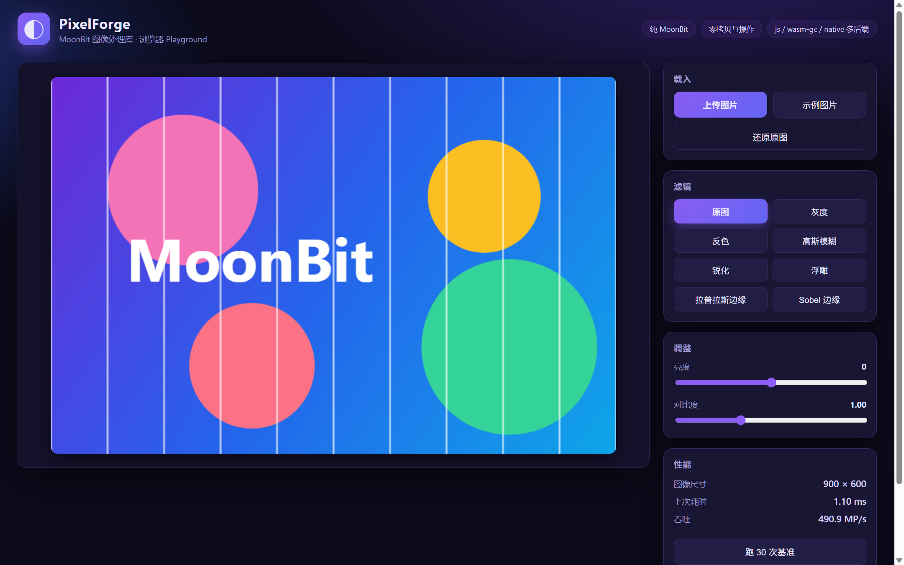
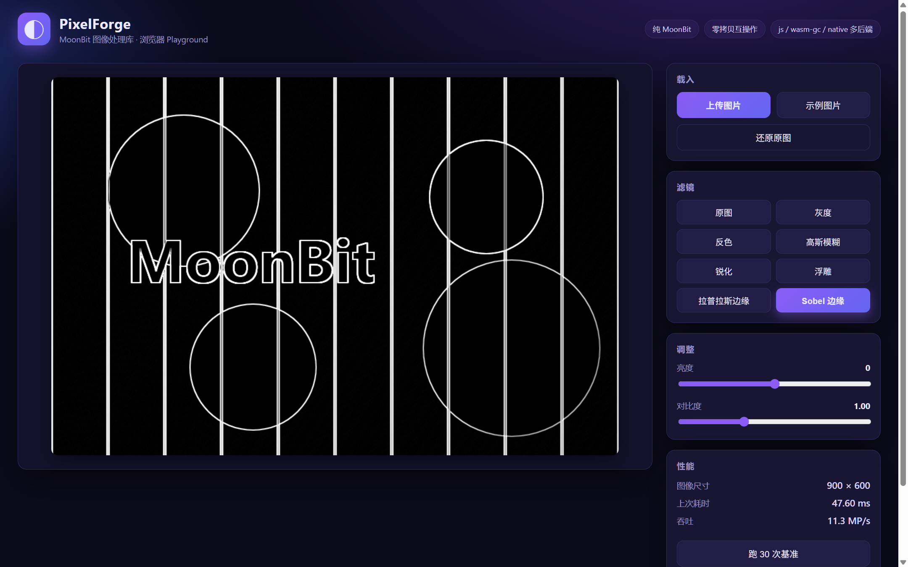

# PixelForge

[](https://github.com/0717lee/pixelforge/actions/workflows/ci.yml)

[English](README.en.md) | 简体中文

> 一个纯 [MoonBit](https://www.moonbitlang.cn/) 实现的图像处理库，附带一个在浏览器里实时运行的 Playground。
> 后端无关的核心库可编译到 **JavaScript / WebAssembly (wasm-gc & 线性内存 wasm) / native**。
>
> **稳定 API 里程碑已发布**：GitHub 保留 `v1.0.0` 作为稳定版标记；当前 MoonBit 包版本为 `0.14.0`（mooncakes.io 要求主版本号为 0）。公开 API 在 0.x 系列中保持兼容，破坏性变更会记录在 CHANGELOG。



*同一界面一键切换 20+ 种滤镜与 JS / WebAssembly 双引擎——以 Sobel 边缘检测为例：*



---

## ✨ 特性

- **丰富的滤镜与几何变换**：灰度、反色、亮度、对比度、高斯/盒式模糊、锐化、浮雕、拉普拉斯/Sobel/Scharr/Canny 边缘、棕褐色、二值化、像素化、中值降噪、直方图均衡、色调分离、伽马校正、暗角、饱和度、色相旋转、水平/垂直翻转；另有 90° 旋转与最近邻/双线性/双三次 (Catmull-Rom) 缩放。
- **形态学运算**：3×3 腐蚀 / 膨胀 / 开运算 / 闭运算。
- **纹理描述**：`lbp_codes()` / `lbp_histogram()` 提供 8 邻域局部二值模式特征。
- **高级特征**：`harris_corners()` 提供确定性的 Harris 角点检测与非极大值抑制。
- **高级特征**：`hog()` 提供可配置 cell/block 的方向梯度直方图，`contours()` 提取阈值连通域边界像素，`skeletonize()` 使用有界 Zhang–Suen 细化生成骨架。
- **流式遍历**：`for_each_tile()` / `for_each_row()` 提供不复制像素缓冲的分块与逐行访问；需要独立图像时再调用 tile 的 `copy()`。
- **图像编解码**：PNG（支持 8-bit 灰度、灰度透明、调色板、RGB/RGBA 与 tRNS；自实现完整 DEFLATE inflate，编码端使用自适应行过滤和 fixed-Huffman 压缩，并校验 CRC-32/Adler-32）、GIF 编码/解码（单帧 GIF89a 编码、变长 LZW、交错、透明索引）、QOI、BMP 与 TIFF（多条带、分块、PackBits/LZW/Deflate、Predictor=2、有限 BigTIFF）解码；JPEG 编解码、WebP Lossless 编解码和 JS 目标 AVIF 编码通过纯 MoonBit/`mizchi/image` 适配。
- **GIF 动画帧**：`gif_decode_all()` 返回每帧图像、位置、延迟、透明索引和 disposal 元数据；`gif_decode()` 继续提供首帧便捷 API。Playground 上传 GIF 时保留浏览器动画预览，编辑管线仍以首帧作为像素输入。
- **格式探测**：`detect_image_format()` 与 `image_metadata()` 可在不解码像素的情况下识别 PNG/GIF/QOI/BMP/JPEG/WebP/AVIF/TIFF，并读取常见容器的尺寸与 GIF 动画标记。
- **仿射变换**：`Affine` 矩阵（旋转/平移/缩放/错切 + 复合 + 求逆），逆映射双线性采样；任意角度 `rotate(degrees)`。
- **绘图原语**：Bresenham 直线、矩形、中点圆、填充，全部自动边界裁剪。
- **可分离高斯模糊**：`gaussian(radius)` 任意半径，二项式权重行列分离，每像素 O(r) 而非 O(r²)。
- **锐化蒙版**：`unsharp_mask(radius, amount)` 复用高斯模糊提取高频细节并回叠，锐化边缘。
- **裁剪与填充**：`crop(x, y, w, h)`（自动限幅）与 `pad(l, t, r, b, color)`（颜色边框），`crop∘pad` 可无损往返。
- **双边滤波**：`bilateral(radius, σs, σr)` 保边平滑——平坦区域降噪，强边缘保持锐利。
- **图像分析**：Otsu 自动阈值（类间方差最大化）、Floyd–Steinberg 误差扩散抖动、四连通连通域标记与计数、chamfer (3,4) 距离变换、感知哈希（aHash/dHash + 汉明距离）。
- **积分图与 O(1) 盒式模糊**：`integral_image()` 求和面积表（Int64 防溢出）驱动 `box_blur(radius)`，任意半径每像素 O(1)。
- **泛洪填充**：`flood_fill(x, y, color, tolerance)` 四连通种子填充，逐通道容差。
- **图层合成**：`composite(top, mode)` Porter-Duff source-over + 8 种混合模式（正片叠底/滤色/叠加/变暗/变亮/差值/线性减淡等），纯整数舍入运算。
- **位图文字**：内置 5×7 字体（数字/大写字母/基本标点），`draw_text` 整数倍缩放、自动裁剪。
- **色彩空间**：RGB ↔ HSV、RGB ↔ HSL（含 `adjust_lightness`）、RGB ↔ YCbCr (BT.601) 精确往返转换。
- **直方图**：`histogram_luma()` / `histogram_rgb()` 256 桶统计；Playground 内置实时亮度直方图面板。
- **通用卷积引擎**：`Kernel` + `Image::convolve`，可自定义任意奇数尺寸卷积核。
- **图像统计与色调**：`stats()` 逐通道 min/max/mean（Int64 累加）、`auto_contrast()` 自动对比度拉伸、`levels(black, white, gamma)` 色阶重映射。
- **确定性噪声**：`add_gaussian_noise(seed, σ)` / `add_salt_pepper(seed, density)`，64 位 LCG 驱动，同 seed 跨后端逐字节一致。
- **图像质量指标**：`mse()` / `psnr()` 比较 RGBA 四通道；`luma_mse()` / `ssim()` 使用 Rec.601 亮度并忽略 alpha。
- **局部阈值与区域统计**：`sauvola()` / `adaptive_mean()` 使用积分图处理局部窗口；`regionprops()` 返回连通域面积、边界框和质心。
- **纯整数、确定性**：滤镜数学尽量用整数（如亮度权重 ×1000），结果可复现；测试覆盖正常、边界和畸形输入（含 CRC-32/Adler-32 公开参考向量与手工汇编的 DEFLATE 位流）。
- **核心库零第三方依赖**：图像处理包只使用 `moonbitlang/core`；native CLI 的文件模式单独使用官方 `moonbitlang/x/fs`。
- **多后端 + 零拷贝互操作**：js 后端下 `FixedArray[Byte]` 就是 `Uint8Array`，与 canvas 的 `Uint8ClampedArray` 零拷贝互通；线性内存 wasm 后端导出 `memory`，宿主直接批量读写像素。
- **浏览器 Playground**：拖拽 / 粘贴 / 上传图片，GIF 保持动画预览，滤镜可叠加成管线，JS/WASM 引擎切换与性能对比，可切换到 **Web Worker 后台线程**处理大图不卡 UI，处理结果用**自家 `png_encode`** 一键下载 PNG。

## 🆚 与 MoonBit 生态中其他图像库的关系

MoonBit 生态中已经存在若干方向相近的图像处理包（如 `megemini/millow`、`PingGuoMiaoMiao/MoonVision`、`shunge/image` 等）。PixelForge 与它们在基础滤镜上不可避免地有重叠（模糊、边缘检测、阈值等是所有图像库的共同基础能力，且本库的实现全部独立手写、以确定性测试驱动），但**定位与核心能力有明显差异**：

| 现有项目 | 定位 | 与 PixelForge 的差异 |
| --- | --- | --- |
| `megemini/millow` | 更广的计算机视觉算法库（增强、轮廓/区域特征、HOG/LBP、SSIM 等） | 侧重 CV 算法；PixelForge 侧重零依赖、多后端编解码和浏览器交互 |
| `PingGuoMiaoMiao/MoonVision` | 轻量图像处理 + 基础 CV（灰度图为主、模板匹配） | 侧重灰度图像处理；不提供 RGBA 全彩编解码、绘图/文字、噪声与哈希 |
| `shunge/image` | 纯解码器（BMP/QOI/TGA/PNG/GIF/JPEG 六格式解码） | 仅解码；不提供滤镜、编码、绘图与分析能力 |

**PixelForge 当前重点打磨的能力**：

- **编解码器广度**：PNG（自实现完整 DEFLATE inflate + CRC-32/Adler-32 校验）、QOI、BMP 的**编+解**与 GIF 解码，全部纯 MoonBit 实现
- **浏览器 Playground**：JS/WASM 双引擎实时对比、Web Worker 后台线程、实时亮度直方图面板、用自家 `png_encode` 下载结果
- **位图字体**：内置 5×7 字体 `draw_text`，可直接在图像上排版文字
- **感知哈希**：aHash / dHash + 汉明距离，图像去重与相似度检索
- **确定性噪声**：64 位 LCG 驱动的高斯 / 椒盐噪声，同 seed 跨后端逐字节重现，配合中值/双边滤波形成降噪演示闭环
- **图像统计与色调**：逐通道 min/max/mean、auto_contrast、levels 色阶
- **工程透明度**：13 个版本的完整演进记录、双语文档、CI 端到端冒烟测试

如果您的项目在 `mooncakes.io` 上看到本库，可通过 `moon add 0717lee/pixelforge` 直接使用；也希望本库的编解码器与 Playground 实现能为生态提供参考。

## 📦 项目结构

```
pixelforge/
├── image.mbt              # Image 数据结构、像素读写、clamp_byte
├── filters_basic.mbt      # map_rgb 引擎 + 灰度/反色/亮度/对比度
├── convolution.mbt        # Kernel + convolve + 模糊/锐化/浮雕/边缘/Sobel/Scharr
├── filters_advanced.mbt   # 棕褐色/二值化/像素化/中值/直方图均衡/色调分离
├── filters_effects.mbt    # 伽马校正/暗角
├── colorspace.mbt         # RGB↔HSV、RGB↔YCbCr、饱和度/色相旋转
├── morphology.mbt         # 3×3 腐蚀/膨胀/开/闭运算
├── canny.mbt              # Canny 边缘检测（NMS + 滞后阈值）
├── affine.mbt             # 仿射变换（旋转/平移/缩放/错切，逆映射采样）
├── drawing.mbt            # 绘图原语（Bresenham 直线/矩形/圆/填充）
├── gaussian.mbt           # 可分离高斯模糊（任意半径，二项式权重）
├── unsharp.mbt            # 锐化蒙版（复用高斯）
├── croppad.mbt            # 裁剪 / 颜色边框填充
├── integral.mbt           # 积分图（SAT）+ O(1) 盒式模糊
├── floodfill.mbt          # 泛洪填充（四连通种子填充）
├── distance.mbt           # chamfer (3,4) 距离变换
├── stats.mbt              # 图像统计 / 自动对比度 / 色阶
├── bicubic.mbt            # 双三次缩放（Catmull-Rom）
├── phash.mbt              # 感知哈希（aHash/dHash + 汉明距离）
├── noise.mbt              # 确定性噪声（高斯 / 椒盐，LCG）
├── hsl.mbt                # HSL 色彩空间 + 亮度调整
├── histogram.mbt          # 直方图 API（亮度 / RGB）
├── bilateral.mbt          # 双边滤波（保边平滑）
├── otsu.mbt               # Otsu 自动阈值（类间方差最大化）
├── dither.mbt             # Floyd–Steinberg 误差扩散抖动
├── components.mbt         # 四连通连通域标记/计数
├── blend.mbt              # 图层合成（source-over + 8 种混合模式）
├── text.mbt               # 5×7 位图字体 draw_char/draw_text
├── png.mbt                # PNG 编解码（完整 DEFLATE inflate + 校验）
├── gif.mbt                # GIF 解码（变长 LZW、交错、透明索引）
├── qoi.mbt                # QOI 图像编解码（完整规范）
├── bmp.mbt                # BMP 编解码（无压缩 24/32 位）
├── transform.mbt          # 水平/垂直翻转、90° 旋转
├── resize.mbt             # 最近邻/双线性缩放
├── dispatch.mbt           # Image::apply_filter_id 统一派发（各绑定共用）
├── pipeline.mbt           # 类型安全、可复用的 Filter / Pipeline 管线 API
├── metrics.mbt            # MSE / PSNR / luma MSE / SSIM
├── adaptive_threshold.mbt # Sauvola / 局部均值阈值
├── regionprops.mbt        # 连通域面积、边界框、质心
├── *_test.mbt             # 确定性测试（黑盒 + 白盒）
├── cmd/main/              # 原生 CLI 示例（moon run cmd/main）
├── cmd/ppm/               # PPM 图像输出示例（moon run cmd/ppm > edges.ppm）
├── cmd/showcase/          # 综合展示（绘图+文字+滤镜+PNG 往返自检）
├── cmd/cli/               # native info/convert 编解码 CLI + 十六进制模式
├── web/                   # 浏览器绑定 + Playground（HTML/CSS/JS）
│   ├── bindings.mbt       #   js 后端绑定 apply_filter（零拷贝）
│   ├── dist/web.js        #   已构建的 MoonBit→JS 产物
│   ├── dist/wasmcore.wasm #   已构建的线性内存 wasm 产物
│   └── index.html / playground.js / style.css
├── wasmcore/              # 线性内存 wasm 绑定（alloc/process + 导出 memory）
├── scripts/build-web.mjs  # 构建并校验 web/dist 产物
└── serve.mjs              # 零依赖静态服务器
```

## 🚀 快速开始

先安装 [MoonBit 工具链](https://www.moonbitlang.cn/download/)。

```bash
moon test              # 运行完整单元测试套件
moon run cmd/main      # 运行原生示例（生成图像并跑滤镜，打印校验和）
moon run cmd/showcase > showcase.ppm   # 综合展示：绘图+文字+滤镜+PNG 往返自检
moon run cmd/ppm > edges.ppm   # 生成一张 Sobel 边缘检测的 PPM 图片
moon run --target native cmd/cli -- --help # 查看文件编解码 CLI
```

启动浏览器 Playground（`web/dist/` 中已包含构建好的产物）：

```bash
node serve.mjs         # 然后打开 http://localhost:8123
```

Playground 默认把上传图片缩放到最长边 1024 像素作为预览，以避免浏览器在连续渲染时占用过多内存；页面会显示实际预览尺寸，下载结果也使用该尺寸。需要处理原始分辨率时，请直接调用库 API 或在宿主中自行设置像素上限。

如需从源码重新构建 Web 产物：

```bash
node scripts/build-web.mjs           # 构建并同步 web/dist/
node scripts/build-web.mjs --check   # 仅检查提交的产物是否同步
```

## 🧑‍💻 库用法

```moonbit
// 从 RGBA 字节缓冲区（w*h*4）构造图像
let img = @pixelforge.Image::from_bytes(width, height, rgba_bytes)

// 链式调用滤镜（每个滤镜返回一张新图，不修改原图）
let stylized = img.grayscale().sobel()
let soft = img.blur().brightness(20)

// 自定义卷积核
let kernel = @pixelforge.Kernel::new(3, [0.0, -1.0, 0.0, -1.0, 5.0, -1.0, 0.0, -1.0, 0.0], 1.0, 0.0)
let sharp = img.convolve(kernel)

// 按数字 id 派发（供各宿主绑定 / CLI 共用）
let out = img.apply_filter_id(8, 0.0) // 8 = Sobel

// 类型安全的可复用管线（按追加顺序执行）
let pipeline = @pixelforge.Pipeline::new()
  .append(@pixelforge.Filter::Grayscale)
  .append(@pixelforge.Filter::Contrast(1.25))
  .append(@pixelforge.Filter::Sobel)
let out2 = img.apply_pipeline(pipeline)

// 质量指标：RGBA 误差与 Rec.601 亮度相似度
let error = img.mse(out2)
let score = img.psnr(out2)
let similarity = img.ssim(out2)

// 取回处理后的像素
let bytes = out.data // FixedArray[Byte]，长度 = width*height*4
```

`mse`/`psnr` 比较 RGBA 四通道；`luma_mse`/`ssim` 使用 Rec.601 luma 并忽略 alpha。`ssim` 使用覆盖整张图的单个 population-statistics 窗口（无滑动窗口补边），相同尺寸的空图返回 1；比较尺寸不一致会拒绝。

### 错误与边界

- `png_decode`、`gif_decode`、`qoi_decode`、`bmp_decode`、`tiff_decode`、`webp_decode` 对格式错误或不支持的输入返回 `None`；核心包仍没有纯 MoonBit 的 AVIF 解码器，浏览器 Playground 通过 `web/codecs.js` 调用原生 WebP/AVIF 解码。
- `Image::new`、`Image::from_bytes` 以及尺寸必须一致的合成操作会拒绝非法尺寸或缓冲区；坐标 API 要求调用方传入图像范围内的坐标。
- 编解码器和构造器都会限制图像尺寸，宿主在接收不可信图片时仍应设置更严格的文件大小和像素上限。
- Playground 主要演示常用滤镜和双后端切换；完整的编解码、几何、绘图、分析和合成 API 通过 MoonBit 库直接使用。

## 🎛️ 滤镜清单

| id | 滤镜 | 方法 | `amount` |
| --- | --- | --- | --- |
| 0 | 灰度 | `grayscale()` | — |
| 1 | 反色 | `invert()` | — |
| 2 | 亮度 | `brightness(delta)` | −255..255 |
| 3 | 对比度 | `contrast(factor)` | 0.0..3.0 |
| 4 | 高斯模糊 | `blur()` | — |
| 5 | 锐化 | `sharpen()` | — |
| 6 | 浮雕 | `emboss()` | — |
| 7 | 拉普拉斯边缘 | `edges()` | — |
| 8 | Sobel 边缘 | `sobel()` | — |
| 9 | 棕褐色 | `sepia()` | — |
| 10 | 二值化 | `threshold(level)` | 阈值（默认 128） |
| 11 | 像素化 | `pixelate(block)` | 块大小（默认 8） |
| 12 | 中值降噪 | `median()` | — |
| 13 | 直方图均衡 | `histogram_equalize()` | — |
| 14 | 水平翻转 | `flip_horizontal()` | — |
| 15 | 垂直翻转 | `flip_vertical()` | — |
| 16 | 色调分离 | `posterize(levels)` | 色阶数（默认 4） |
| 17 | 伽马校正 | `gamma(value)` | 伽马值（默认 2.2） |
| 18 | 暗角 | `vignette(strength)` | 强度 0..1（默认 0.5） |
| 19 | Scharr 边缘 | `scharr()` | — |
| 20 | Canny 边缘 | `canny(low, high)` | 高阈值（默认 100，低阈值取一半） |
| 21 | Otsu 自动阈值 | `otsu()` | — |
| 22 | Floyd–Steinberg 抖动（二值） | `dither_mono()` | — |

> 会改变尺寸的变换不走 id 派发，直接调用库 API：`rotate90()`、`resize_nearest(w, h)`、`resize_bilinear(w, h)`、`resize_bicubic(w, h)`。多参数 / 非图像→图像的 API 同理：`average_hash()`/`difference_hash()`/`hamming_distance`、`add_gaussian_noise`/`add_salt_pepper`、`histogram_luma()`/`histogram_rgb()`、`rgb_to_hsl`/`hsl_to_rgb`/`adjust_lightness`、`box_blur(radius)`、`flood_fill(x, y, color, tol)`、`distance_transform(t)`、`gaussian(radius)`、`unsharp_mask(radius, amount)`、`crop(x, y, w, h)`、`pad(l, t, r, b, color)`、`bilateral(radius, σs, σr)`、`dither_grayscale(levels)`/`dither_mono()`、`otsu_threshold()`、`label_components(t)`/`count_components(t)`、`composite(top, mode)`、`draw_text(...)`、`rotate(deg)`、`translate(dx, dy)`、`affine(t)`、`draw_line`/`draw_rect`/`draw_circle` 等绘图原语、`saturate(factor)`、`hue_rotate(deg)`、`erode()`/`dilate()`/`morph_open()`/`morph_close()`、`png_encode`/`png_decode`、`gif_encode`/`gif_decode`、`qoi_encode`/`qoi_decode`、`bmp_encode`/`bmp_decode`、`tiff_decode`、`jpeg_decode`/`jpeg_encode`、`webp_encode`、`avif_encode`、`rgb_to_hsv` 等色彩空间函数。

## 🏗️ 架构与多后端

核心库完全后端无关。两个宿主绑定包分别演示两种进出 MoonBit 的方式：

- **`web/`（js 后端）**：MoonBit 的 `FixedArray[Byte]` 编译为 JS `Uint8Array`，因此 canvas 的 `ImageData.data`（`Uint8ClampedArray`）可以**零拷贝**直接传入 `apply_filter`。
- **`wasmcore/`（线性内存 wasm 后端）**：链接时用 `export-memory-name` 导出线性 `memory`；`alloc(len)` 返回的指针**直接指向数据**（实测零 header 偏移），宿主用 `Uint8Array` 视图批量写入像素后调用 `process`。

> **一个诚实的性能观察**：在浏览器里对同一套滤镜做基准对比，MoonBit 的 **js 后端反而比线性内存 wasm 快约 4–5×**。原因是 V8 对 JS 后端产物做了深度 JIT 优化，而 wasm 路径还多了进/出线性内存的拷贝与运行时开销。这说明"WASM 一定更快"是一种误解——Playground 保留了引擎切换与对比按钮，你可以自己复现这个结论。

## ✅ 测试

```bash
moon test                 # 默认后端（wasm-gc）
moon test --target js     # js 后端
```

测试覆盖每个滤镜、变换、绘图原语、合成模式、字体、分析算法与编解码器，并包含畸形输入和尺寸边界；期望值均为手工推导（脉冲响应、平场不变性、已知边缘、直方图重映射、编码字节精确长度、无损往返、CRC-32/Adler-32 公开参考向量、手工汇编的 DEFLATE 与 GIF LZW 位流等），在 wasm-gc、js 与 native 后端下均通过；GitHub Actions 持续集成。

## 📮 发布到 mooncakes.io

> 模块名为 `0717lee/pixelforge`。其他 MoonBit 项目可通过 `moon add 0717lee/pixelforge` 添加依赖。

```bash
moon login             # 登录 mooncakes.io
moon publish           # 发布
```

## 📄 许可证

[Apache-2.0](LICENSE)
